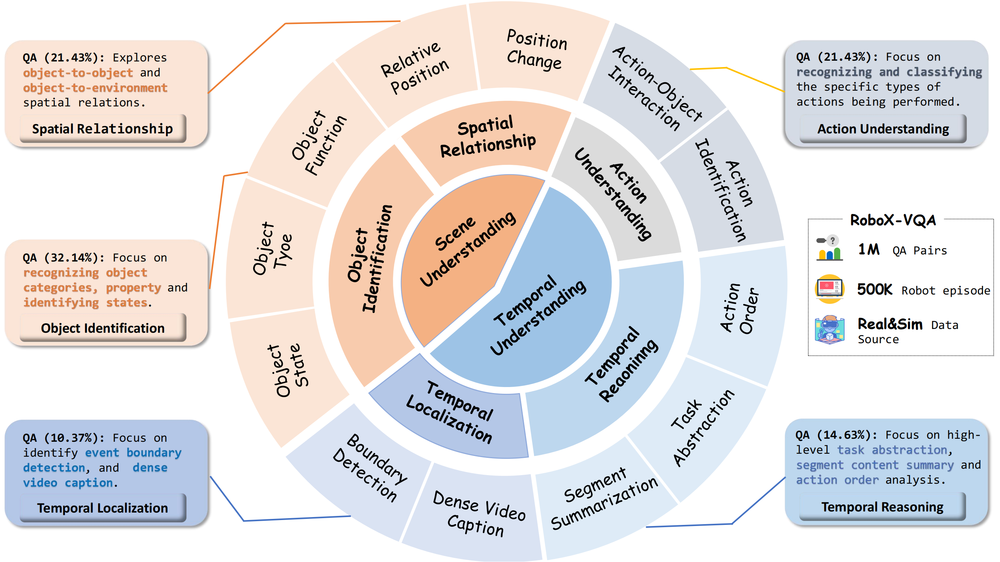
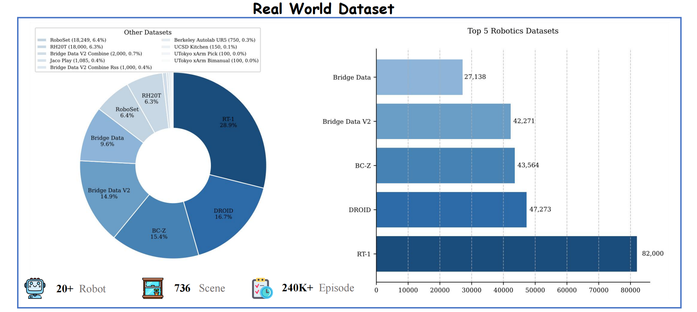
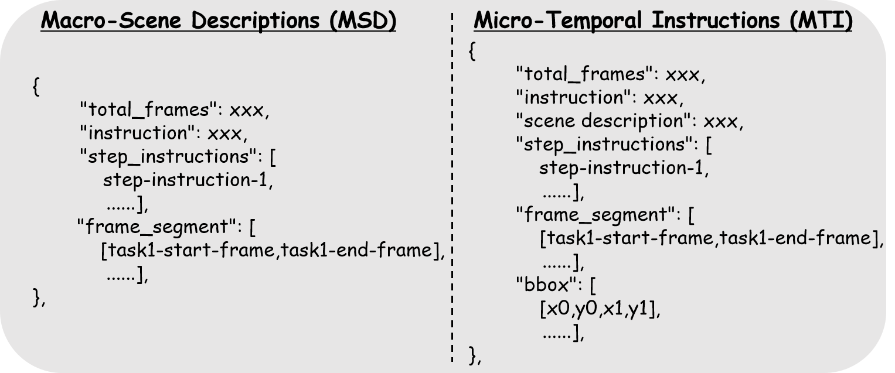

# RoboX-VQA Dataset

**RoboX-VQA**, a large-scale, high-quality and context-rich robotics VQA dataset across diverse scenarios.

<a href='https://roboannotatex.github.io/'></a>
<a href='https://arxiv.org/abs/2311.17043'></a>
<a href='https://huggingface.co/koulx/roboannotatorx'></a>
<a href='https://huggingface.co/datasets/koulx/RoboX-VQA'></a>

## Overview of RoboX-VQA


## Data Sources
### 💡 Real World Data
The foundation of RoboX-VQA(real) builds upon Open X-Embodiment, which encompasses over 1 million real robot trajectories spanning 22 distinct robot
platforms and demonstrating 527 unique skills across 160,266 task instances. To extend this foundation, we developed two additional long-horizon manipulation datasets: bridge data v2 combine (2K trajectories) and bridge data v2 combine rss
(1K trajectories)


### 🎁 Sim Data
Simulated data serves as a **complementary resource** to real-world datasets by addressing key challenges such as the scarcity of long-horizon data and sparse annotations. It enables:
- Enable the generation of **Large-scale, High-quality, Consistent data**.
- **Diversity and Richness** in training datasets, especially for rare or complex task scenarios. 
- Scalability in generating and annotating data, ensuring continuous model improvements.


## Data Prepraring
### Raw Dataset

### Meta-Information
We leverages GPT-4o’s capabilities to automatically generate comprehensive question-answer pairs from text meta-information, 
the **dual-source meta-information** provides rich contextual data for QA generation.



### Automatic QA Generation
```
Your task is to compare the predicted answer with the correct answer and determine if they match meaningfully. Here’s
how you can accomplish the task:
——
##INSTRUCTIONS:
- Focus on the meaningful match between the predicted answer and the correct answer.
- Consider synonyms or paraphrases as valid matches.
- Evaluate the correctness of the prediction compared to the answer.
Please evaluate the following video-based question-answer pair:
Question: question
Correct Answer: answer
Predicted Answer: pred
Provide your evaluation only as a yes/no and score where the score is an integer value between 0 and 5, with 5 indicating
the highest meaningful match. Consider the following guidelines:
1. Minor differences in object descriptions should not necessarily result in a negative evaluation if the overall action is
correct.
2. Consider the potential for slight misinterpretations in visual details, especially for similar objects or surfaces.
Please generate the response in the form of a Python dictionary string with keys ’pred’ and ’score’, where value of ’pred’
is a string of ’yes’ or ’no’ and value of ’score’ is in INTEGER, not STRING.
DO NOT PROVIDE ANY OTHER OUTPUT TEXT OR EXPLANATION. Only provide the Python dictionary string.
```
Our prompt engineering follows a structured approach with several key components: 
- **Meta-Information Integration**: Each prompt begins by providing the available meta-information as context, ensuring GPT-4o has access to the details of the demonstration.  
- **Task Type Specification**: The prompt explicitly defines the type of understanding to be probed. 
- **Question Format Guidelines**: We provide clear instructions on question formatting. 
- **Answer Constraint Specifications**: To maintain evaluation consistency, we define answer format requirements tailored to 
each question type.

## Data Format 

## Evaluation

## Citation