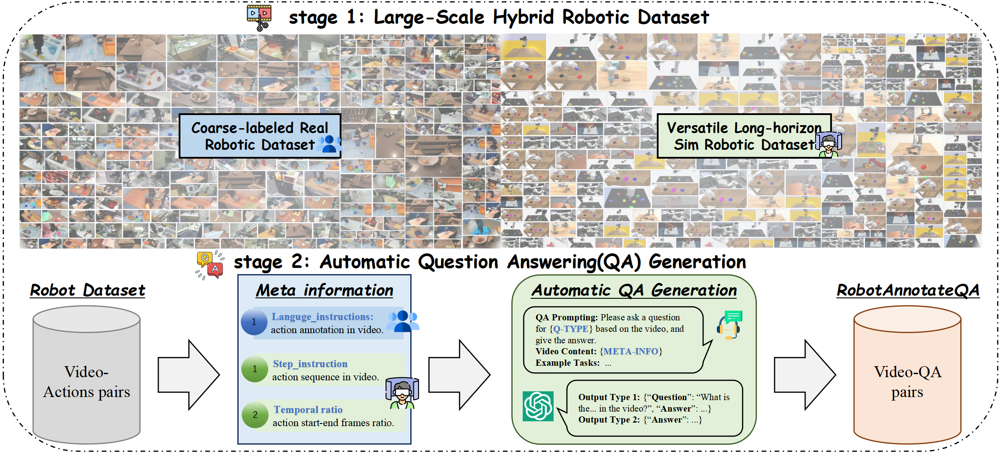

# RoboX-VQA Dataset

**RoboX-VQA**, a large-scale robotics VQA dataset across diverse scenarios.

## Overview of RoboX-VQA

## Data Sources
The foundation of RoboX-VQA builds upon Open X-Embodiment, which encompasses over 1 million real robot trajectories spanning 22 distinct robot
platforms and demonstrating 527 unique skills across 160,266 task instances. To extend this foundation, we developed two additional long-horizon manipulation datasets: bridge data v2 combine (2K trajectories) and bridge data v2 combine rss
(1K trajectories)

## Data Prepraring

## Data Format 

## Evaluation

## Citation